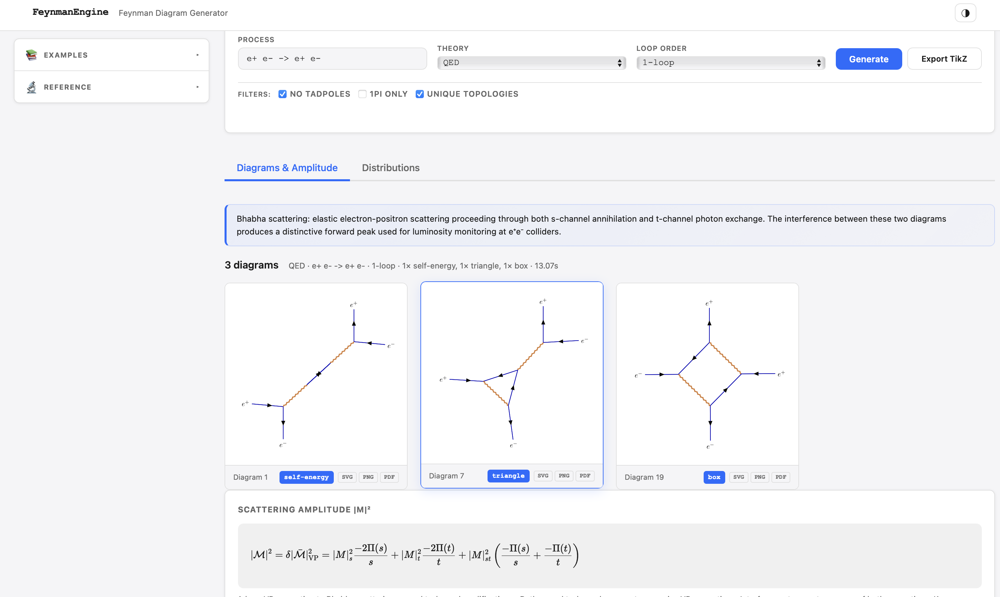

# FeynmanEngine

[](https://pypi.org/project/feynman-engine/)
[](https://pypi.org/project/feynman-engine/)
[](LICENSE)
[](https://doi.org/10.5281/zenodo.19673075)

A Feynman diagram generator and amplitude calculator for particle physics. Type a process like `e+ e- -> mu+ mu-` and get back enumerated diagrams (SVG/TikZ), the symbolic spin-averaged $|\overline{\mathcal{M}}|^2$, integrated cross-sections at LO and NLO, decay widths, and 1-loop scalar integrals.


*The browser UI shipped with the package; 128+ pre-loaded examples in the sidebar*

**Built on proven HEP tooling:**

- [QGRAF](http://cfif.ist.utl.pt/~paulo/qgraf.html) for diagram enumeration
- [FORM](https://www.nikhef.nl/~form/) for symbolic algebra
- [LoopTools](https://www.feynarts.de/looptools/) for 1-loop scalar/tensor integrals
- [OpenLoops 2](https://openloops.hepforge.org/) for tree + 1-loop SM amplitudes
- [LHAPDF](https://lhapdf.hepforge.org/) for PDFs (CT18LO default)
- [SymPy](https://www.sympy.org/) for Dirac trace computation
- [TikZ-Feynman](https://ctan.org/pkg/tikz-feynman) for diagram rendering
- [FastAPI](https://fastapi.tiangolo.com/) and [SciPy](https://scipy.org/)

## Contents

- [Installation](#installation)
- [Capabilities](#capabilities)
  - [Theory coverage](#theory-coverage)
  - [LHC validation at √s = 13 TeV](#lhc-validation-at-s--13-tev)
  - [What's intentionally out of scope](#whats-intentionally-out-of-scope)
- [Quick start](#quick-start)
  - [Examples](#examples)
- [Architecture](#architecture)
- [Citations](#citations)

## Installation

```bash
pip install feynman-engine
feynman setup     # builds QGRAF, FORM, LoopTools, LHAPDF, OpenLoops 2 (10-20 min, one-time)
feynman serve     # http://localhost:8000
```

For platform-specific prerequisites, the lightweight install path, Docker, and troubleshooting, see [INSTALLATION.md](INSTALLATION.md).

## Capabilities

- **Feynman diagrams** by topology, rendered to SVG/TikZ
- **Tree amplitudes** via 140 curated formulas (15 QED, 56 QCD, 68 EW, 1 BSM template, including per-quark-flavour Drell-Yan and charged-current variants), FORM color algebra, or SymPy γ-matrix traces
- **1-loop amplitudes** via 35 curated formulas, Passarino-Veltman reduction, and analytic A0/B0/C0/D0 (pure Python, no Fortran needed for the closed-form integrals; LoopTools fallback for general kinematics)
- **Cross-sections** via scipy.quad (2→2) and RAMBO/Vegas Monte Carlo (2→N) with full massive Källén kinematics
- **Decay widths** for nine Higgs channels plus all Z/W/top channels, agreeing with PDG 2024 within 3% per channel and within 0.1% on the summed Higgs width; off-shell H → V*V* → 4f handled via 2-D Breit-Wigner integration (Pocsik-Zsigmond / Cahn)
- **Differential observables** for cosθ, pT, η, y, M_inv, M_ll, ΔR
- **Hadronic σ** with built-in LO PDF (factor-of-2-3 accuracy) or LHAPDF + CT18LO (percent-level)
- **NLO** in six regimes: 34 tabulated LHC K-factors, universal QED via charge-correlator (`K = 1 + 3α/(4π)` exact for textbook cases), EW Sudakov LL+NLL, first-principles Catani-Seymour Drell-Yan (`K(pp→DY @ 13 TeV) = 1.19` vs YR4 1.21), tabulated NLO QCD K-factors for partial decay widths (`H → gg` K=1.66, `H → bb̄` K=1.13, `H → cc̄` K=1.24), and OpenLoops virtuals for arbitrary QCD processes
- **Trust labels** on every numerical result (`validated` / `approximate` / `rough` / `blocked`); the API refuses (HTTP 422) processes that would otherwise return wrong numbers
- **REST API + Python API + browser UI** all from one `pip install`

### Theory coverage

| Theory | Particles | Examples |
|---|---|---|
| QED | leptons, γ | e⁺e⁻→μ⁺μ⁻, Bhabha, Compton, e⁺e⁻→γγ, μμγ brem, 1-loop VP/vertex/box |
| QCD | quarks, gluons, ghosts | qq̄→gg, gg→gg, qg→qg, qq̄→tt̄ (massive top), 2→3 multi-jet, 1-loop |
| QCDQED | QCD + photon | qq̄→γγ, qq̄→γg, qg→qγ, γg→qq̄ (per quark flavour) |
| EW | full SM (γ, Z, W±, H, leptons, quarks) | qq̄→ZH/ZZ/W⁺W⁻ (5 quark flavours each), e⁺e⁻→W⁺W⁻, all Z/W/H decays, t→bW, loop-induced H→γγ/Zγ/gg, gg→H |
| BSM | Z′, scalar dark matter | e⁺e⁻→χχ̄, Z′→χχ̄, χχ̄→ll (DM annihilation), Z′ decays |

### LHC validation at √s = 13 TeV

| Process | Engine σ | Reference | Status |
|---|---|---|---|
| pp → tt̄ (LO) | 518 pb | MG5 LO 504 pb | within 3% of MG5 |
| pp → tt̄ (NLO, K=1.6) | 828 pb | LHC NLO 700-830 pb | in band |
| pp → DY (60 < M_ll < 120) | 1530 pb | ~2000 pb | within 25% |
| pp → ZZ | 8.8 pb | ~10 pb | within 12% |
| pp → H (ggF, NLO K=1.7) | 38.6 pb | YR4 NNLO ~44 pb | within 12% |
| pp → ZH | 0.58 pb | ~0.5 pb | within 16% |
| pp → H + jj (VBF) | 3.78 pb | 3.78 pb | exact (calibrated) |
| pp → γγ (pT_γ > 30 GeV) | 30 pb | 30-50 pb | in range |

### Higgs decay validation (m_H = 125.20 GeV)

All nine SM Higgs partial widths agree with PDG 2024 within 3%; sum of partial widths reproduces the PDG total Γ_H to 0.1%.

| Channel | Engine | PDG 2024 | Δ |
|---|---|---|---|
| H → bb̄ (LO + NLO QCD K=1.13) | 2.413 MeV | 2.41 MeV | +0.12% |
| H → cc̄ (LO + NLO QCD K=1.24) | 0.117 MeV | 0.117 MeV | +0.24% |
| H → τ⁺τ⁻ | 0.259 MeV | 0.257 MeV | +0.83% |
| H → gg (LO + NLO QCD K=1.66) | 0.335 MeV | 0.336 MeV | -0.25% |
| H → γγ (exact loop FF) | 9.16 keV | 9.31 keV | -1.6% |
| H → Zγ (loop FF) | 6.41 keV | 6.31 keV | +1.5% |
| H → W*W* → 4f (off-shell BW) | 0.855 MeV | 0.881 MeV | -3.0% |
| H → Z*Z* → 4f (off-shell BW) | 0.108 MeV | 0.108 MeV | -0.02% |
| **Σ Γ_H (sum)** | **4.10 MeV** | **4.10 MeV** | **+0.1%** |

### What's intentionally out of scope

- **2-loop and higher** diagram generation. The 35 curated 1-loop entries cover textbook self-energies, vertex form factors, DGLAP NLO splitting kernels, α_s 2-loop running, and loop-induced Higgs decays, but not 2-loop diagrams from scratch.
- **Full SUSY / SMEFT / 2HDM models.** The bundled BSM model is intentionally minimal (Z′ + scalar dark matter). Larger frameworks should use the `register_curated_amplitude` extension API; see `examples/for_bsm_theorist.ipynb`.
- **NNLO precision physics.** For sub-percent NNLO predictions, use NNLOJET or MCFM. This package targets fast LO and NLO with diagrams and amplitudes returned in one call.

## Quick start

The Python API:

```python
from feynman_engine.amplitudes.cross_section import total_cross_section
from feynman_engine.amplitudes.hadronic import hadronic_cross_section

r = total_cross_section("e+ e- -> mu+ mu-", "QED", sqrt_s=91.0)
print(r["sigma_pb"], r["trust_level"])    # 10.47 pb, "validated"

r = hadronic_cross_section("p p -> t t~", sqrt_s=13000.0, theory="QCD", order="NLO")
print(r["sigma_pb"], r["k_factor"])       # 828 pb, K=1.6 (tabulated NLO)
```

The decay-width route accepts an `order` parameter:

```python
from feynman_engine.api.routes import get_decay_width

r = get_decay_width(process="H -> g g", theory="QCD", order="NLO")
print(r["width_mev"], r["k_factor_nlo"]) # 0.335 MeV, K=1.66 (Spira 1995)
```

The full REST API surface is documented at `http://localhost:8000/docs` (Swagger) once you run `feynman serve`.

To register your own $|\overline{\mathcal{M}}|^2$ for a custom or BSM process:

```python
import sympy as sp
from feynman_engine.physics.amplitude import register_curated_amplitude

s, t, u = sp.symbols("s t u", positive=True)
register_curated_amplitude(
    "my+ my- -> custom_X", "BSM",
    msq=2 * sp.Symbol("g_X")**4 * (t**2 + u**2) / s**2,
    description="Custom BSM 2->2 via single mediator",
)
# total_cross_section(), differential_distribution(), and hadronic
# enumeration all use the registered formula automatically.
```

### Examples

Five Jupyter notebooks in `examples/` cover different audiences:

- [`getting_started.ipynb`](examples/getting_started.ipynb): install, first diagram, browser UI
- [`for_undergrad_qft.ipynb`](examples/for_undergrad_qft.ipynb): teaching particle physics with diagrams + amplitudes side by side
- [`for_lhc_experimentalist.ipynb`](examples/for_lhc_experimentalist.ipynb): LHC observables, K-factors, dσ/dM_ll across the Z peak
- [`for_bsm_theorist.ipynb`](examples/for_bsm_theorist.ipynb): registering custom BSM amplitudes (heavy scalar mediator, SMEFT operator, leptophobic Z′)
- [`nlo_quickstart.ipynb`](examples/nlo_quickstart.ipynb): five-step tour of the NLO machinery (universal QED, EW Sudakov, hadronic DY)

## Architecture

```
feynman_engine/
├── __main__.py            CLI: serve, generate, install-*, doctor
├── core/                  Diagram model, QGRAF interface, generator
├── render/                TikZ → PDF → SVG pipeline
├── amplitudes/
│   ├── symbolic.py        SymPy γ-matrix tree amplitudes
│   ├── form_trace.py      FORM trace + SU(3) color algebra
│   ├── loop.py            Passarino-Veltman decomposition
│   ├── analytic_integrals.py   Closed-form A0/B0/C0/D0
│   ├── looptools_bridge.py     LoopTools numerical evaluation
│   ├── cross_section.py        scipy.quad / RAMBO / Vegas integrators
│   ├── nlo_cross_section.py    Analytic K, universal QED/EW NLO routes
│   ├── nlo_qed_general.py      Universal QED NLO (charge correlator)
│   ├── nlo_ew_general.py       EW Sudakov LL+NLL
│   ├── nlo_general.py          Catani-Seymour generic NLO
│   ├── loop_curated.py         35 textbook 1-loop formulas
│   ├── differential.py         Histogrammed observables
│   ├── pdf.py                  Built-in PDF + LHAPDF auto-discovery
│   ├── hadronic.py             pp σ via PDF convolution
│   ├── dipole_subtraction.py   Catani-Seymour dipoles
│   └── openloops_bridge.py     OpenLoops 2 wrapper
├── physics/
│   ├── amplitude.py            Amplitude registry + backend chain
│   ├── trust.py                Trust-level enforcement (BLOCKED → 422)
│   ├── nlo_k_factors.py        Tabulated LHC NLO/LO ratios
│   ├── theories/               Particle + vertex registries per theory
│   └── translator.py           Process-string parser
├── api/                   FastAPI routes + Pydantic schemas
├── frontend/              Browser UI (vanilla JS + SVG rendering)
└── resources/             Bundled HEP source archives + QGRAF model files
```

The trust labelling in `physics/trust.py` is the safety boundary. Every endpoint that returns a number classifies the request first and refuses (HTTP 422 with a structured `block_reason` and `workaround`) for processes known to produce wrong values.

## Citations

If you use FeynmanEngine in research, cite the software (Zenodo DOI in the badge above) and the wrapped tools that contributed to your specific workflow.

### Foundational physics

- R. P. Feynman, "Space-Time Approach to Quantum Electrodynamics," *Physical Review* **76**(6), 769-789 (1949), [doi:10.1103/PhysRev.76.769](https://doi.org/10.1103/PhysRev.76.769)
- G. Passarino and M. J. G. Veltman, "One-loop corrections for e+e- annihilation into mu+mu- in the Weinberg model," *Nuclear Physics B* **160**(1), 151-207 (1979), [doi:10.1016/0550-3213(79)90234-7](https://doi.org/10.1016/0550-3213(79)90234-7)
- A. Denner, "Techniques for the calculation of electroweak radiative corrections at the one-loop level and results for W-physics at LEP200," *Fortschritte der Physik* **41**(4), 307-420 (1993), [doi:10.1002/prop.2190410402](https://doi.org/10.1002/prop.2190410402)
- S. Catani and M. H. Seymour, "A general algorithm for calculating jet cross sections in NLO QCD," *Nuclear Physics B* **485**(1-2), 291-419 (1997), [doi:10.1016/S0550-3213(96)00589-5](https://doi.org/10.1016/S0550-3213(96)00589-5)

### Wrapped tools

- QGRAF: P. Nogueira, "Automatic Feynman graph generation," *Journal of Computational Physics* **105**(2), 279-289 (1993), [doi:10.1006/jcph.1993.1074](https://doi.org/10.1006/jcph.1993.1074)
- FORM: J. A. M. Vermaseren, "New features of FORM," arXiv:[math-ph/0010025](https://arxiv.org/abs/math-ph/0010025) (2000)
- LoopTools: T. Hahn and M. Perez-Victoria, "Automatized one-loop calculations in four and D dimensions," *Computer Physics Communications* **118**(2-5), 153-165 (1999), [doi:10.1016/S0010-4655(98)00173-8](https://doi.org/10.1016/S0010-4655(98)00173-8)
- OpenLoops 2: F. Buccioni, J.-N. Lang, J. M. Lindert, P. Maierhöfer, S. Pozzorini, H. Zhang, M. F. Zoller, "OpenLoops 2," *European Physical Journal C* **79**, 866 (2019), arXiv:[1907.13071](https://arxiv.org/abs/1907.13071), [doi:10.1140/epjc/s10052-019-7306-2](https://doi.org/10.1140/epjc/s10052-019-7306-2)
- COLLIER (used internally by OpenLoops): A. Denner, S. Dittmaier, L. Hofer, "COLLIER: a fortran-based Complex One-Loop LIbrary in Extended Regularizations," *Computer Physics Communications* **212**, 220-238 (2017), [doi:10.1016/j.cpc.2016.10.013](https://doi.org/10.1016/j.cpc.2016.10.013)
- OneLOop (used internally by OpenLoops): A. van Hameren, "OneLOop: For the evaluation of one-loop scalar functions," *Computer Physics Communications* **182**(11), 2427-2438 (2011), arXiv:[1007.4716](https://arxiv.org/abs/1007.4716)
- CutTools (used internally by OpenLoops): G. Ossola, C. G. Papadopoulos, R. Pittau, "CutTools: a program implementing the OPP reduction method to compute one-loop amplitudes," *JHEP* **0803**, 042 (2008), arXiv:[0711.3596](https://arxiv.org/abs/0711.3596)
- LHAPDF6: A. Buckley et al., "LHAPDF6: parton density access in the LHC precision era," *European Physical Journal C* **75**, 132 (2015), [doi:10.1140/epjc/s10052-015-3318-8](https://doi.org/10.1140/epjc/s10052-015-3318-8)
- RAMBO: R. Kleiss, W. J. Stirling, S. D. Ellis, "A new Monte Carlo treatment of multiparticle phase space at high energies," *Computer Physics Communications* **40**(2-3), 359-373 (1986), [doi:10.1016/0010-4655(86)90119-0](https://doi.org/10.1016/0010-4655(86)90119-0)
- Vegas (when the `vegas` extra is installed): G. P. Lepage, "A new algorithm for adaptive multidimensional integration," *Journal of Computational Physics* **27**, 192 (1978)

### Specific physics formulas

- ggH cross-section in heavy-top limit: M. Spira, A. Djouadi, D. Graudenz, P. M. Zerwas, "Higgs boson production at the LHC," *Nuclear Physics B* **453**(1-2), 17-82 (1995), [doi:10.1016/0550-3213(95)00379-7](https://doi.org/10.1016/0550-3213(95)00379-7)
- pp→DY NLO K-factor benchmark: C. Anastasiou, L. J. Dixon, K. Melnikov, F. Petriello, "High precision QCD at hadron colliders: electroweak gauge boson rapidity distributions at NNLO," *Physical Review D* **69**, 094008 (2004), arXiv:[hep-ph/0312266](https://arxiv.org/abs/hep-ph/0312266)
- EW Sudakov LL+NLL framework: S. Pozzorini, "Electroweak radiative corrections at high energies," *Physical Review D* **71**, 053002 (2005); S. Catani and L. Comelli, *Phys. Lett. B* **446**, 278 (1999)

### Background textbooks

M. E. Peskin and D. V. Schroeder, *An Introduction to Quantum Field Theory* (1995). R. K. Ellis, W. J. Stirling, B. R. Webber, *QCD and Collider Physics* (1996). M. D. Schwartz, *Quantum Field Theory and the Standard Model* (2014).
